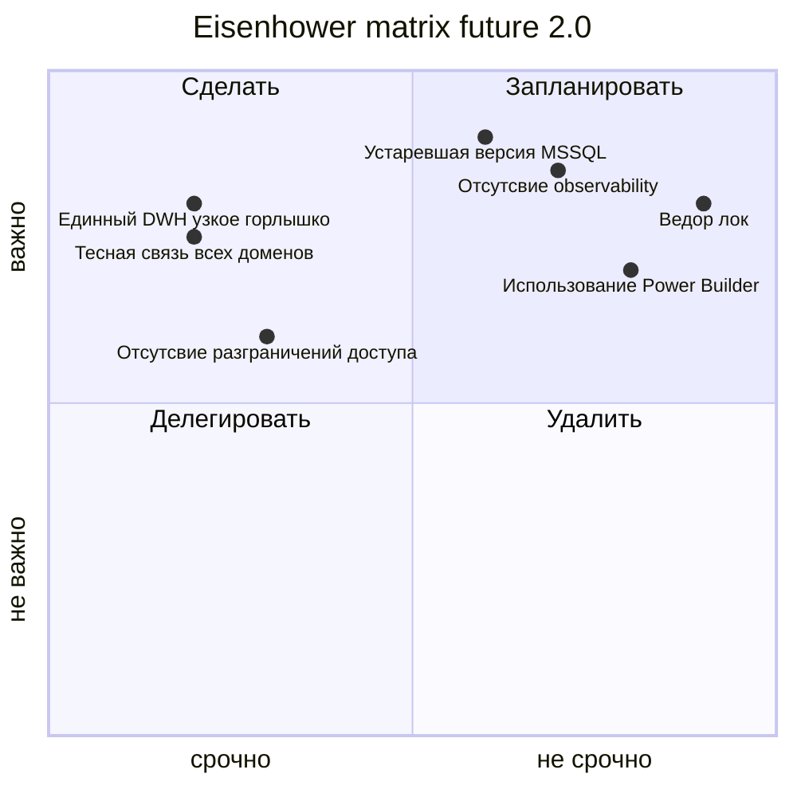

## Проблемные места будущее 2.0

- Единая точка хранения разрозненных данных является узким горлышко компании, которое тяжело масштабировать 
- Вендор лок на MSSQL
- Использование устаревшей версии MSSQL, которая может содержать уязвимости и не использует современные подходы к оптимизациям хранилищ данных
- Использование Power Builder - устаревшая технология, которую сложно поддерживать из-за отсутсвия экспертизы у современных разработчиков
- Отсутсвие систем аудита и observability в целом, что может приводить к проблемам утечки данных и инцидентам из-за деградации сервисов без своевременного реагирования 
- Все домены тесно связаны с собой, что может приводить к трудностям поддержки и развития сервисов, так как изменения в одном домене, могут затронуть сразу все процессы в компании 
- Все данные лежат в одном месте без разграничения доступа, систем тегирования и шифрования. Может приводить к утечкам 

## Приоритет решения проблем по матрице Эйзенхауэра

